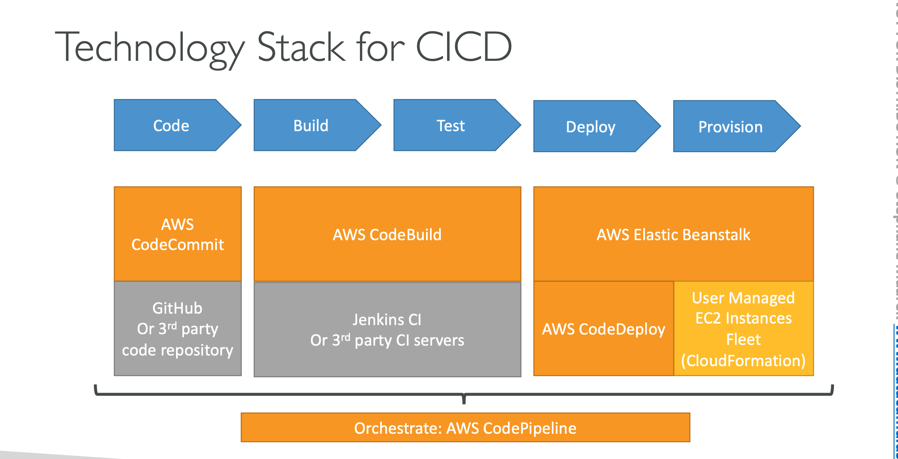

AWS Certified DevOps Engineer Professional 2023 - Hands On!
, Stephane Maarek

- Section 1: Course overview
- Section 2: Code & Slides Download
- Section 3: SLDC (Software Development Life Cycle) Automation
4. CICD Overiew:
+ Continous Integration

    

+ Continous Delivery:

    

+ Continous Delivery vs Continous Deployment:  
Continous Delivery may invole a manual step to approvev a deployment  
Continous Deployment: Full automation  
+ Technology Stack for CICD:

    

