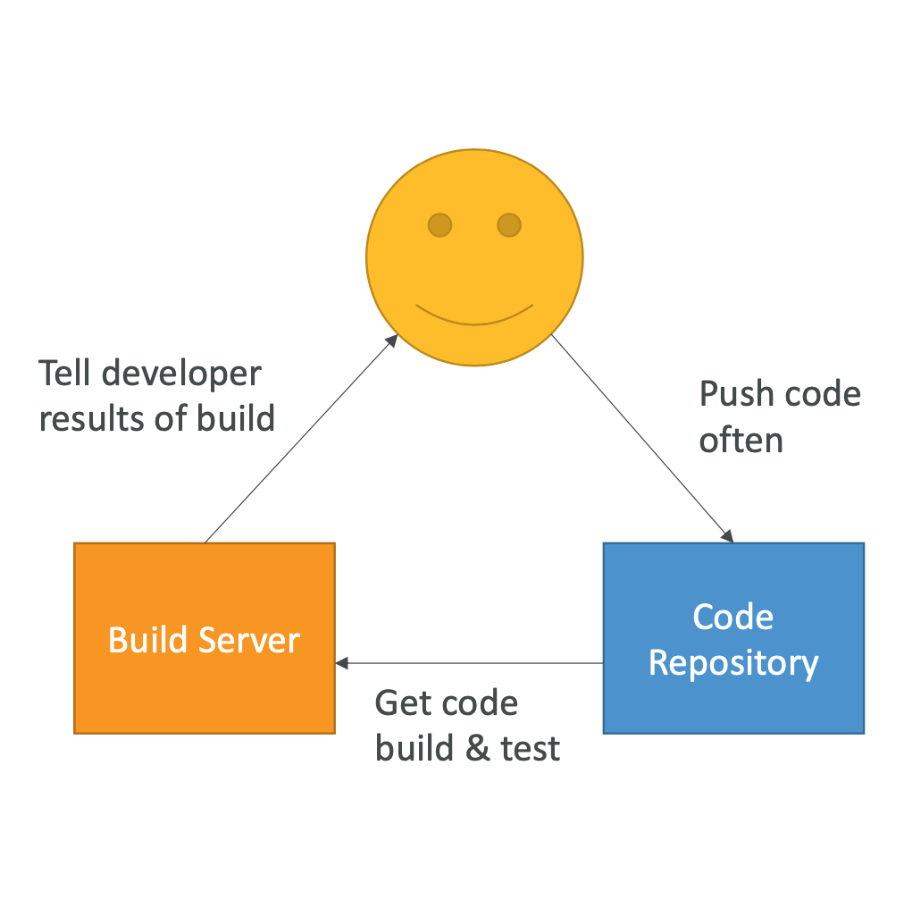
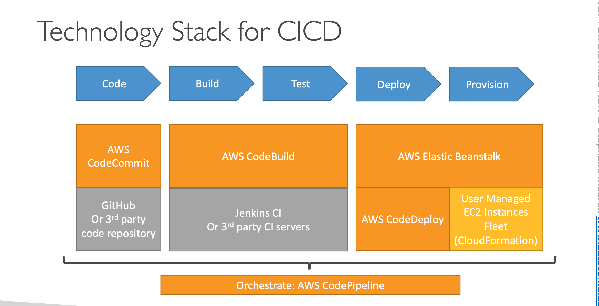

### AWS Certified DevOps Engineer Professional 2023 - Hands On!, Stephane Maare

- [Section 1: Course overview]()
- [Section 2: Code & Slides Download]()
- [Section 3: SLDC (Software Development Life Cycle) Automation]()

    
 4. CICD Overiew: 

+ Continous Integration

    

+ Continous Delivery:

    

+ Continous Delivery vs Continous Deployment:  
Continous Delivery may invole a manual step to approvev a deployment  
Continous Deployment: Full automation  
+ Technology Stack for CICD:

    

5. Reference Link: 

CodeCommit

    https://www.atlassian.com/git/tutorials/using-branches

    https://docs.aws.amazon.com/codecommit/latest/userguide/auth-and-access-control-iam-identity-based-access-control.html

    https://aws.amazon.com/blogs/devops/refining-access-to-branches-in-aws-codecommit/

    https://docs.aws.amazon.com/codecommit/latest/userguide/how-to-notify.html

    https://docs.aws.amazon.com/codecommit/latest/userguide/how-to-repository-email.html )

    https://docs.aws.amazon.com/codecommit/latest/userguide/how-to-notify-lambda.html

    https://docs.aws.amazon.com/codecommit/latest/userguide/how-to-migrate-repository-existing.html

CodeBuild

    https://docs.aws.amazon.com/codebuild/latest/userguide/build-spec-ref.html

    https://docs.aws.amazon.com/codebuild/latest/userguide/samples.html

    https://docs.aws.amazon.com/codebuild/latest/userguide/sample-docker.html

    https://aws.amazon.com/blogs/devops/validating-aws-codecommit-pull-requests-with-aws-codebuild-and-aws-lambda/

CodeDeploy

    https://docs.aws.amazon.com/codedeploy/latest/APIReference/API_MinimumHealthyHosts.html

    https://docs.aws.amazon.com/codedeploy/latest/userguide/reference-appspec-file-structure-hooks.html

    https://docs.aws.amazon.com/codedeploy/latest/userguide/reference-appspec-file-structure-hooks.html#appspec-hooks-server

    https://docs.amazonaws.cn/en_us/codedeploy/latest/userguide/reference-appspec-file-structure-hooks.html#reference-appspec-file-structure-environment-variable-availability

    https://docs.aws.amazon.com/codedeploy/latest/userguide/monitoring-cloudwatch-events.html

    https://aws.amazon.com/blogs/devops/view-aws-codedeploy-logs-in-amazon-cloudwatch-console/

    https://docs.aws.amazon.com/codedeploy/latest/userguide/monitoring-sns-event-notifications.html

    https://docs.aws.amazon.com/codedeploy/latest/userguide/deployments-rollback-and-redeploy.html

    https://docs.aws.amazon.com/codedeploy/latest/userguide/deployment-groups-configure-advanced-options.html

    https://docs.aws.amazon.com/codedeploy/latest/userguide/instances-on-premises.html

    https://docs.aws.amazon.com/codedeploy/latest/userguide/register-on-premises-instance-iam-user-arn.html

    https://docs.aws.amazon.com/codedeploy/latest/userguide/register-on-premises-instance-iam-session-arn.html

    https://docs.aws.amazon.com/codedeploy/latest/userguide/deployment-configurations.html#deployment-configuration-lambda

    https://docs.aws.amazon.com/codedeploy/latest/userguide/reference-appspec-file-structure-hooks.html#appspec-hooks-lambda

CodePipeline

    https://docs.aws.amazon.com/codepipeline/latest/userguide/reference-pipeline-structure.html#action-requirements

    https://docs.aws.amazon.com/codepipeline/latest/userguide/best-practices.html#use-cases

    https://docs.aws.amazon.com/codepipeline/latest/userguide/actions-invoke-lambda-function.html

    https://docs.aws.amazon.com/codepipeline/latest/userguide/actions-create-custom-action.html

    https://docs.aws.amazon.com/codepipeline/latest/APIReference/API_PutJobSuccessResult.html

    https://docs.aws.amazon.com/AWSCloudFormation/latest/UserGuide/continuous-delivery-codepipeline.html

    https://docs.aws.amazon.com/codepipeline/latest/userguide/tutorials-cloudformation.html

    https://github.com/aws-samples/codepipeline-nested-cfn

    https://aws.amazon.com/blogs/devops/implementing-gitflow-using-aws-codepipeline-aws-codecommit-aws-codebuild-and-aws-codedeploy/

CodeStar

    https://docs.aws.amazon.com/codestar/latest/userguide/templates.html

Jenkins

    https://aws.amazon.com/getting-started/projects/setup-jenkins-build-server/

    https://wiki.jenkins.io/display/JENKINS/Amazon+EC2+Plugin

    https://aws.amazon.com/blogs/devops/setting-up-a-ci-cd-pipeline-by-integrating-jenkins-with-aws-codebuild-and-aws-codedeploy/

    https://wiki.jenkins.io/display/JENKINS/AWS+CodeBuild+Plugin

    https://wiki.jenkins.io/display/JENKINS/Amazon+EC2+Container+Service+Plugin

    https://wiki.jenkins.io/display/JENKINS/Artifact+Manager+S3+Plugin

    https://wiki.jenkins.io/display/JENKINS/AWS+CodePipeline+Plugin 

    
6. CodeCommit

- Version Control 
- Central online git repository 
- Collaborate, backup code 
- AWS CodeCommit: private Git repositories 

    
7. CodeCommit - First Repo & HTTPs config

- 2 ways connect to CodeCommit: SSH and HTTPs 
- HTTPs: create IAM Role 

    
8. CodeCommit - clone, add, commit, push

- Should commit appspec.yml (CodeDeploy) + buildspec.yml (CodeBuild) 

    
9. CodeCommit - Branches and Pull Requests

- Should have master branch, staging branch, feature branches 
- git push --set-upstream ... if the current branch has no up-stream branch 
- Create Pull Request from feature branches to master branch 

    
10. CodeCommit - Securing the Repository and Branches

    - Limit Pushes and Merges to Branches (eg. only Admin can merge the code to master) by attaching Policy to IAM User (eg. Deny codecommit:DeleteBranch) 

    
11. CodeCommit - Triggers & Notifications

    - Automation with Notifications, Triggers (connect to SNS, Lambda) 
    - Should create Repository tags. 

    
12. CodeCommit - & AWS Lambda

    - Lambda is good for automation  
    - Send notification to Lambda or trigger Lambda  

    
13. CodeBuild - Overview

    - Fully managed build service, such as Jenkins Build  
    - Continuous scaling (no servers to manage or provision – no build queue)  
    - Leverages Docker under the hood, can use your own Docker, pay as use  
    - Secure: Integration with KMS for encryption of build artifacts,IAM for build permissions, and VPC for network security, CloudTrail for API calls logging.

    
13. CodeBuild - Overview

    - Fully managed build service, such as Jenkins Build  
    - Continuous scaling (no servers to manage or provision – no build queue)  
    - Leverages Docker under the hood, can use your own Docker, pay as use  
    - Secure: Integration with KMS for encryption of build artifacts,IAM for build permissions, and VPC for network security, CloudTrail for API calls logging.
    - Source Code from GitHub / CodeCommit / CodePipeline / S3...  
    - Build instructions can be defined in code (buildspec.yml file)  
    - Output logs to Amazon S3 & AWS CloudWatch Logs  
    - Metrics to monitor CodeBuild statistics  
    - Use CloudWatch Events to detect failed builds and trigger notifications  
    - Use CloudWatch Alarms to notify if you need “thresholds” for failures  
    - CloudWatch Events / AWS Lambda as a Glue  
    - SNS notifications  

    
14. CodeBuild - First Build

    - Choose Source with reference types (branch, git tag, commit ID) to build  
    - Choose Manage Image or Custom image (your own Docker)

